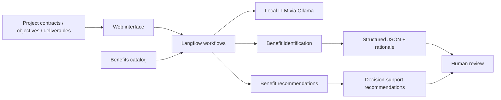

# AI-Driven Portfolio Value Management

> A proof of concept for using local AI agents to support benefits identification and value-oriented decision making in project portfolios.

## Why this project

Organizations often manage project scope, schedule, and cost effectively while still struggling with a harder question: **are the projects actually creating the intended value?**

This repository explores how AI can support benefits management across the project portfolio lifecycle. The current proof of concept focuses on two complementary use cases:

1. **Benefit Identification Agent** — analyzes project contracts and deliverables, extracts deliverables, and maps them to a structured benefits catalog with a contribution score and rationale.
2. **Benefit Recommendation Agent** — reviews a proposed project objective and deliverables, identifies weak or missing benefit coverage, and recommends improvements from either a project-level or portfolio-level perspective.

The prototype is designed as **decision support, not autonomous decision making**. Recommendations are intended for human review.

## What is implemented

- Two Langflow agent workflows.
- Local LLM execution with Ollama / Qwen2.5.
- A structured benefits catalog used as grounding context.
- A web interface for PDF contract processing and benefit identification.
- A web interface for project objective/deliverable review and benefit recommendations.
- Role-aware analysis for researchers/project leaders and portfolio/PMO managers.

## Architecture



For more detail, see [`docs/architecture.md`](docs/architecture.md).

## Repository structure

```text
.
├── README.md
├── flows/
│   ├── benefit-identification-flow.json
│   └── benefit-recommendation-flow.json
├── web/
│   ├── benefit-identification.html
│   └── benefit-recommendation.html
├── data/
│   ├── sample-benefits-catalog.json
│   └── README.md
├── docs/
│   ├── research-context.md
│   ├── architecture.md
│   ├── use-cases.md
│   └── limitations-roadmap.md
├── manuals/
│   ├── benefit-identification-user-guide.md
│   └── benefit-recommendation-user-guide.md
├── SECURITY.md
└── .gitignore
```

## Technology stack

- **Langflow** — orchestration of agent workflows.
- **Ollama** — local model serving.
- **Qwen2.5** — local language model used in the original PoC.
- **HTML / JavaScript** — lightweight user interfaces.
- **JSON** — structured benefit catalog and agent outputs.

## Quick start

### Requirements

- Python 3.10–3.12
- Langflow
- Ollama
- Qwen2.5 available locally
- Modern web browser

### Run locally

1. Install Ollama and pull the model:

```bash
ollama pull qwen2.5
```

2. Start Langflow and import the two JSON files in `flows/`.
3. In the relevant Langflow `Read File` node, load `data/sample-benefits-catalog.json`.
4. Copy the new Flow ID generated by Langflow.
5. Serve the web interface:

```bash
cd web
python -m http.server 8000
```

6. Open either:

```text
http://localhost:8000/benefit-identification.html
http://localhost:8000/benefit-recommendation.html
```

7. Enter your local Langflow endpoint / Flow ID. If authentication is enabled, create a new API key locally; **never commit API keys to GitHub**.

## Example use cases

### 1. Benefit identification from an existing project

Input: a project contract in PDF.

Output: a structured mapping between project deliverables and potential benefits, including benefit category, contribution level, and rationale.

### 2. Benefit-aware project formulation

Input: a proposed project objective and deliverables.

Output: recommendations to strengthen the objective, make expected benefits explicit, and propose additional deliverables that improve measurability and value realization.

### 3. Portfolio perspective

A portfolio/PMO role can request recommendations focused on cross-project value, strategic alignment, and portfolio-level benefits rather than only the individual project.

## Research direction

This proof of concept is part of a broader research direction on **AI-enabled project portfolio value management**. Future work includes historical benefit knowledge bases, vector retrieval, benefit-realization monitoring agents, predictive models, and prescriptive decision support.

See [`docs/research-context.md`](docs/research-context.md) and [`docs/limitations-roadmap.md`](docs/limitations-roadmap.md).

## Responsible AI

The system is intentionally human-in-the-loop. LLM outputs may be incomplete or inaccurate, and benefit realization cannot be inferred solely from text. Recommendations should be validated by project and portfolio experts before use in decisions.

## Publication note

This public draft has been sanitized for portfolio use: credentials, local machine paths, real contracts, and institution-specific project data are excluded. Before publishing, confirm that you have permission to release any institution-specific benefit catalog, screenshots, names, or documentation.

## Status

**Proof of concept / applied research prototype.**

The current repository demonstrates an end-to-end working concept rather than a production-ready institutional system.
