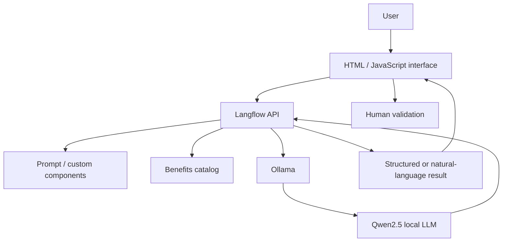
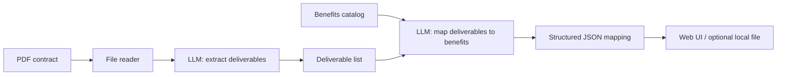
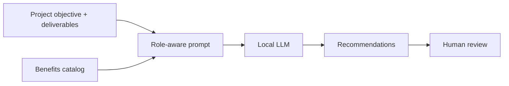

# Architecture

## Overview

The proof of concept uses a deliberately lightweight local architecture so organizational documents can remain within the local environment.

## Flow A — Benefit Identification

The output records the project/contract, deliverable, identified benefit, category, associated indicator, rationale, and contribution/confidence level.

## Flow B — Benefit Recommendation

The user can request a project-level view or a portfolio/PMO view. Recommendations can include clearer objectives, missing benefits, changes to deliverables, and additional deliverables.

## Design choices

### Local model execution

The original PoC uses Ollama and Qwen2.5 locally. This reduces dependence on external model services and supports greater control over document processing. Local execution does **not** remove the need for access controls, auditability, security, and quality assurance.

### Human-in-the-loop

The system does not autonomously approve projects or determine whether benefits will materialize. Its role is to surface relationships and recommendations for expert review.
